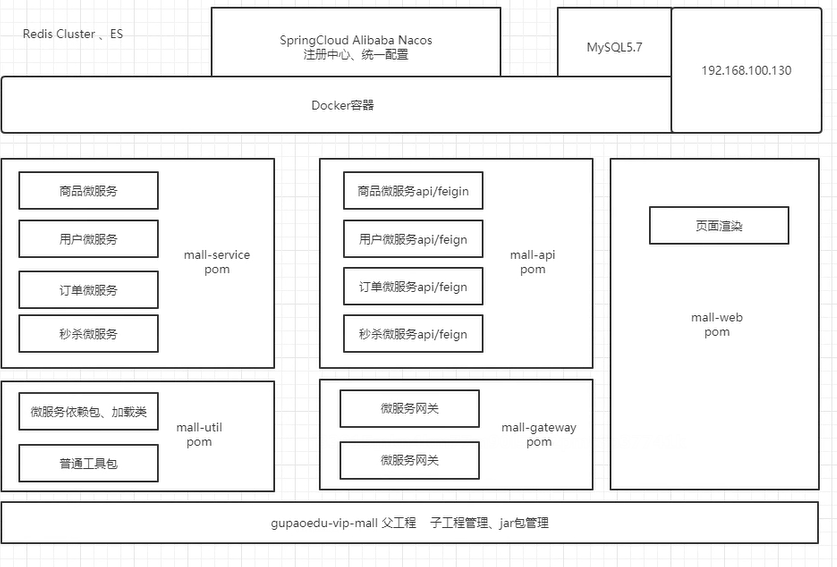

# Getting Started

### Reference Documentation

For further reference, please consider the following sections:

* [Official Apache Maven documentation](https://maven.apache.org/guides/index.html)
* [Spring Boot Maven Plugin Reference Guide](https://docs.spring.io/spring-boot/docs/2.6.1/maven-plugin/reference/html/)
* [Create an OCI image](https://docs.spring.io/spring-boot/docs/2.6.1/maven-plugin/reference/html/#build-image)
* [Spring Security](https://docs.spring.io/spring-boot/docs/2.6.1/reference/htmlsingle/#boot-features-security)
* [Spring Web](https://docs.spring.io/spring-boot/docs/2.6.1/reference/htmlsingle/#boot-features-developing-web-applications)
* [Spring Data Reactive Redis](https://docs.spring.io/spring-boot/docs/2.6.1/reference/htmlsingle/#boot-features-redis)
* [MyBatis Framework](https://mybatis.org/spring-boot-starter/mybatis-spring-boot-autoconfigure/)
* [Thymeleaf](https://docs.spring.io/spring-boot/docs/2.6.1/reference/htmlsingle/#boot-features-spring-mvc-template-engines)
* [Spring Data Redis (Access+Driver)](https://docs.spring.io/spring-boot/docs/2.6.1/reference/htmlsingle/#boot-features-redis)

### Guides

The following guides illustrate how to use some features concretely:

* [Securing a Web Application](https://spring.io/guides/gs/securing-web/)
* [Spring Boot and OAuth2](https://spring.io/guides/tutorials/spring-boot-oauth2/)
* [Authenticating a User with LDAP](https://spring.io/guides/gs/authenticating-ldap/)
* [Building a RESTful Web Service](https://spring.io/guides/gs/rest-service/)
* [Serving Web Content with Spring MVC](https://spring.io/guides/gs/serving-web-content/)
* [Building REST services with Spring](https://spring.io/guides/tutorials/bookmarks/)
* [Messaging with Redis](https://spring.io/guides/gs/messaging-redis/)
* [MyBatis Quick Start](https://github.com/mybatis/spring-boot-starter/wiki/Quick-Start)
* [Handling Form Submission](https://spring.io/guides/gs/handling-form-submission/)
* [Messaging with Redis](https://spring.io/guides/gs/messaging-redis/)


## Architecture:




## DB:
firewall-cmd --zone=public --add-port=3306/tcp --permanent
firewall-cmd --reload
docker run -di --name could-db-mysql -p 3306:3306 -e MYSQL_ROOT_PASSWORD=123456 mysql 
docker run -di --name could-db-mysql -p 3306:3306 -e MYSQL_ROOT_PASSWORD=123456 could-db-mysql:v1
alter user 'root'@'%' identified with mysql_native_password by '123456';

## Docker:
docker run -d -p 8848:8848 -e MODE=standalone -v /opt/nacos/init.d/custom.properties:/home/nacos/init.d/custom.properties -v /opt/nacos/logs:/home/nacos/logs --restart always --name could-nacos nacos/nacos-server


## ceph install
192.168.79.128 master
192.168.79.130 worker1
192.168.79.188 worker2


```shell
# in  192.168.79.128
sed -i  '$a 192.168.79.128 master' /etc/hostname 
vi /etc/hosts
192.168.79.128 master
192.168.79.130 worker1
192.168.79.188 worker2
# in  192.168.79.130
sed -i  '$a 192.168.79.130 worker1' /etc/hostname 
vi /etc/hosts
192.168.79.128 master
192.168.79.130 worker1
192.168.79.188 worker2

# in  192.168.79.188
sed -i  '$a 192.168.79.188 worker2' /etc/hostname 
vi /etc/hosts
192.168.79.128 master
192.168.79.130 worker1
192.168.79.188 worker2

# ---------- for all instance begin ---------------------------
# china local set up begin -------------

vi /etc/yum.repos.d/ceph.repo

[Ceph]
name=Ceph packages for $basearch
baseurl=https://mirrors.tuna.tsinghua.edu.cn/ceph/rpm-mimic/el7/x86_64/
enabled=1
gpgcheck=1
type=rpm-md
gpgkey=https://download.ceph.com/keys/release.asc
[Ceph-noarch]
name=Ceph noarch packages
# 清华源
baseurl=https://mirrors.tuna.tsinghua.edu.cn/ceph/rpm-mimic/el7/noarch/
enabled=1
gpgcheck=1
type=rpm-md
gpgkey=https://download.ceph.com/keys/release.asc
[ceph-source]
name=Ceph source packages
baseurl=https://mirrors.tuna.tsinghua.edu.cn/ceph/rpm-mimic/el7/SRPMS/
enabled=1
gpgcheck=1
type=rpm-md
gpgkey=https://download.ceph.com/keys/release.asc


chmod 777 /etc/yum.repos.d/ceph.repo

# china local set up end -------------
yum update  -y 
yum install epel-release -y
yum install lttng-ust -y
yum -y install ceph ceph-deploy 

# ---------- for all instance end ---------------------------

# for master
# install ntp to syn date for master 
yum install ntp ntpdate ntp-doc -y
# startup with turn on
systemctl enable ntpd
# vi /etc/rc.d/rc.local s/$/&TAIL/g
sed -i '$a /usr/sbin/ntpdate ntp1.aliyun.com > /dev/null 2>&1; /sbin/hwclock -w  '  /etc/rc.d/rc.local
# set up crontab crontab -e
0 */1 * * * ntpdate ntp1.aliyun.com > /dev/null 2>&1; /sbin/hwclock -w


# add new user for all instance 
useradd -d /home/cuser -m cuser
passwd cuser
echo "cuser ALL = (root) NOPASSWD:ALL" | sudo tee /etc/sudoers.d/cuser
sudo chmod 0440 /etc/sudoers.d/cuser

ssh-copy-id cuser@master
ssh-copy-id cuser@worker1  
ssh-copy-id cuser@worker2


vi ~/.ssh/config

Host master
Hostname master
User cuser
Host worker1
Hostname worker1
User cuser
Host worker2
Hostname worker2
User cuser

chmod 600 ~/.ssh/config


# 
sed -i '$a SELINUX=disabled' /etc/selinux/config

# ---------------------- install CEPH begin  ----------------
mkdir -p /usr/local/cephcluster
cd /usr/local/cephcluster
# 
ceph-deploy new master worker1 worker2


vi /usr/local/cephcluster/ceph.conf

#对外开放网段
public network = 192.168.79.0/24
# 设置pool池默认分配数量
osd pool default size = 2
# 容忍更多的时钟误差
mon clock drift allowed = 2
mon clock drift warn backoff = 30
# 允许删除pool
mon_allow_pool_delete = true
[mgr]
# 开启WEB仪表盘
mgr modules = dashboard

# install
ceph-deploy install master worker1 worker2


ceph-deploy mon create-initial
# install model
ceph-deploy admin master worker1 worker2
ceph-deploy mgr create master worker1 worker2
ceph-deploy rgw create master worker1 worker2
ceph-deploy mds create master worker1 worker2
# if any failed  clean then re-view again
ceph-deploy purge master worker1 worker2
ceph-deploy purgedata master worker1 worker2
ceph-deploy forgetkeys
rm -rf /var/run/ceph/

# add new zero sent space for master
# install OSD
ceph-deploy osd create --data /dev/sdb master
ceph-deploy osd create --data /dev/sdb worker1
ceph-deploy osd create --data /dev/sdb worker2

ceph cephadm osd activate 192.168.79.130


#install dashboard
ceph mgr module enable dashboard
ceph dashboard create-self-signed-cert
mkdir -p /usr/local/gupao/cephcluster/mgr-dashboard
openssl req -new -nodes -x509 -subj "/O=IT/CN=ceph-mgr-dashboard" -days 3650 -keyout dashboard.key -out dashboard.crt -extensions v3_ca
# start dashboard
ceph mgr module disable dashboard
ceph mgr module enable dashboard
#set up ip and port
ceph config set mgr mgr/dashboard/server_addr 192.168.79.128
ceph config set mgr mgr/dashboard/server_port 8443
# close https
ceph config set mgr mgr/dashboard/ssl false
# check service
ceph mgr services
# set up user name and password 
ceph dashboard set-login-credentials admin admin
#request link
https://192.168.79.128:8443/#/dashboard 

# install   file management   system of cephfs
# create  store pool
ceph osd pool create cephfs_data 128
ceph osd pool create cephfs_metadata 64
# ceph osd lspools
#少于5个OSD可把pg_num设置为128
#OSD数量在5到10，可以设置pg_num为512
#OSD数量在10到50，可以设置pg_num为4096
#OSD数量大于50，需要计算pg_num的值
# create fs  
ceph fs new fs_cloud cephfs_metadata cephfs_data
ceph fs ls 
# install ceph-fuse 
yum -y install ceph-fuse
# create dir for save data
mkdir -p /usr/local/cephfs_directory
# path mapping 
ceph-fuse -k /etc/ceph/ceph.client.admin.keyring -m 192.168.79.128:6789 /usr/local/cephfs_directory
#
df -h
# using Swift API for Ceph
#id 为主用户， subuser为子用户信息， secret指定密钥， 不指定则随机生成， access拥有权限设定,
#代码中需使用返回信息中的user和secret_key。
sudo radosgw-admin user create --subuser="cephCloud:subCloud" --uid="cephCloud" --display-name="cephCloud" --key-type=swift --secret="js" --access=full
#result :
  {
    "user_id": "cephCloud",
    "display_name": "cephtester",
    "email": "",
    "suspended": 0,
    "max_buckets": 1000,
    "auid": 0,
    "subusers": [
        {
            "id": "cephCloud:subCloud",
            "permissions": "full-control"
        }
    ],
    "keys": [],
    "swift_keys": [
        {
            "user": "cephCloud:subCloud",
            "secret_key": "gupao"
        }
    ],
    "caps": [],
    "op_mask": "read, write, delete",
    "default_placement": "",
    "placement_tags": [],
    "bucket_quota": {
        "enabled": false,
        "check_on_raw": false,
        "max_size": -1,
        "max_size_kb": 0,
        "max_objects": -1
    },
    "user_quota": {
        "enabled": false,
        "check_on_raw": false,
        "max_size": -1,
        "max_size_kb": 0,
        "max_objects": -1
    },
    "temp_url_keys": [],
    "type": "rgw",
    "mfa_ids": []
}

# create admin user
radosgw-admin user create --uid=mgruser --display-name=mgruser --system
result:
  {
    "user_id": "mgruser",
    "display_name": "mgruser",
    "email": "",
    "suspended": 0,
    "max_buckets": 1000,
    "auid": 0,
    "subusers": [],
    "keys": [
        {
            "user": "mgruser",
            "access_key": "9J7OOOX2DHU3SL7RER9R",
            "secret_key": "BtBxqFac5xJZACvQkZVa3MlhabDMoOWM9eenO3IQ"
        }
    ],
    "swift_keys": [],
    "caps": [],
    "op_mask": "read, write, delete",
    "system": "true",
    "default_placement": "",
    "placement_tags": [],
    "bucket_quota": {
        "enabled": false,
        "check_on_raw": false,
        "max_size": -1,
        "max_size_kb": 0,
        "max_objects": -1
    },
    "user_quota": {
        "enabled": false,
        "check_on_raw": false,
        "max_size": -1,
        "max_size_kb": 0,
        "max_objects": -1
    },
    "temp_url_keys": [],
    "type": "rgw",
    "mfa_ids": []
}

#accroding access-key and secret-key execute commond as below:
ceph dashboard set-rgw-api-access-key 9J7OOOX2DHU3SL7RER9R
ceph dashboard set-rgw-api-secret-key BtBxqFac5xJZACvQkZVa3MlhabDMoOWM9eenO3IQ 

# ---------------------- install CEPH end  ----------------

```


